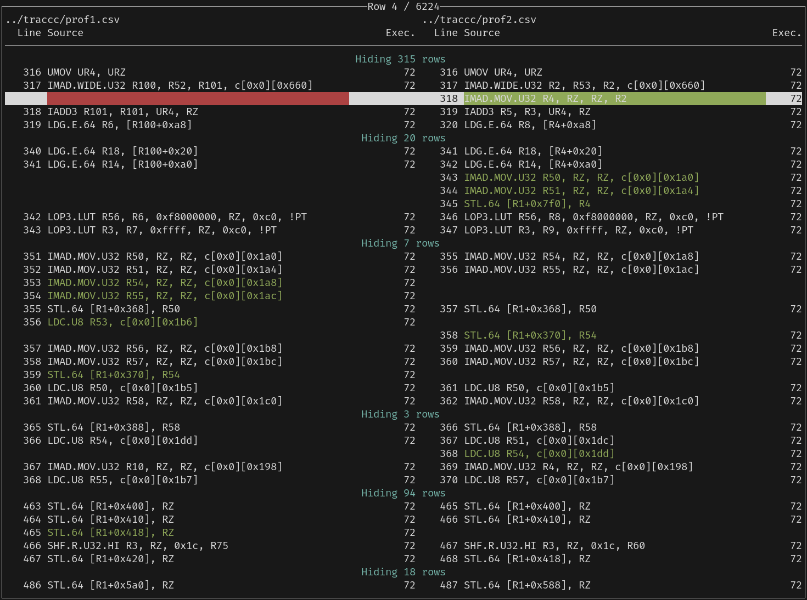

# Sassaparilla

Sassaparilla is a side-by-side comparison tool for SASS profiles generated
by NVIDIA NSight Compute. Although NSight Compute allows useful comparisons
between profiles, it doesn't provide source-level comparisons.

> [!WARNING]
> Sassaparilla is currently in very early beta, and might break unexpectedly
> at any time.

## Usage

Sassaparilla is designed to be used with Stack. First, we should export our
ncu profiles as CSV files:

```
ncu --print-source sass --page source --import my_profile1.ncu-rep --csv -c 1 > prof1.csv
ncu --print-source sass --page source --import my_profile2.ncu-rep --csv -c 1 > prof2.csv
```

Note that the `-c 1` serves to ensure that profile data for only one kernel is
exported. We can then run Sassaparilla:

```
stack run prof1.csv prof2.csv
```


